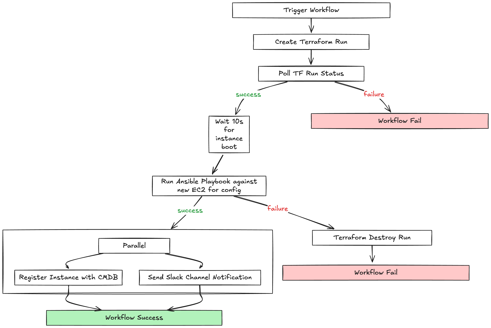
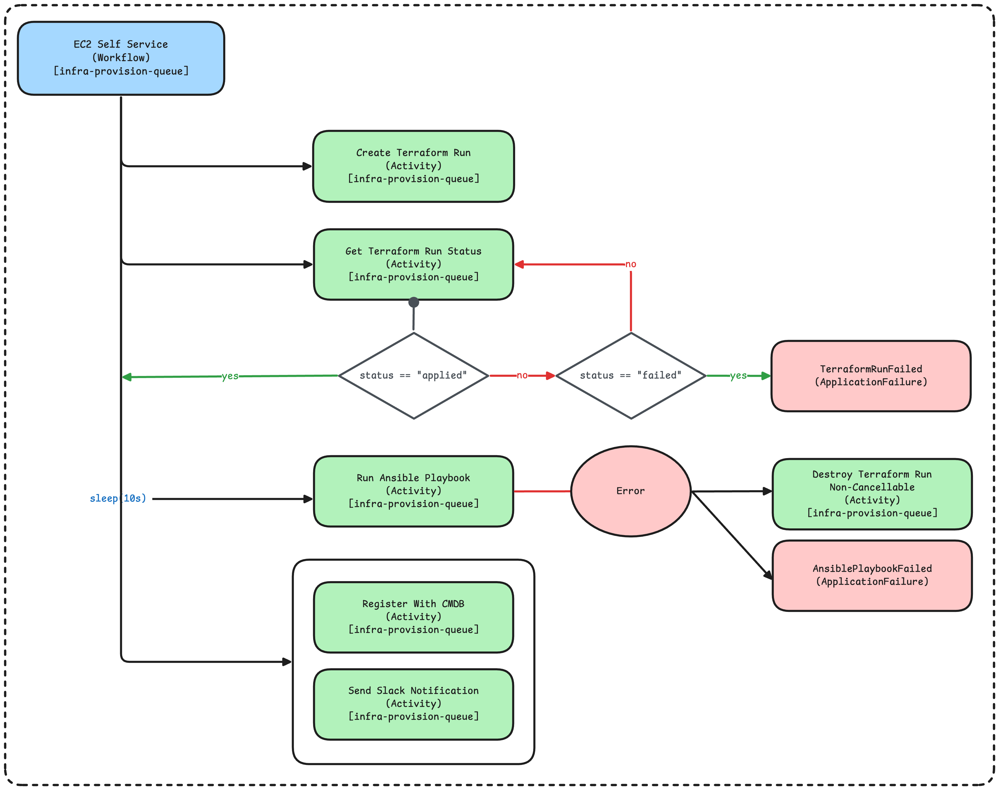

# temporal-infrastructure-pipeline

## Use Case

An infrastructure team is looking for a modular and resilient approach to infrastructure provisioning. They want to be able to provision and configure EC2 instances through a self-service API. They also want to be able to track the status of their infrastructure in a CMDB and receive notifications when instances are provisioned.

## What This Does

1. Create a Terraform run
2. Poll the status of the Terraform run
3. Run Ansible playbook
    - If successful, send notifications in parallel
        - Slack Notification
        - Update CMDB Record
    - If failed, destroy the Terraform run and fail the workflow

### Business Flow


### Technical Implementation


## Project Structure

```
src/
├── workflows.ts              # Main workflow orchestration
├── client.ts                 # Workflow execution trigger
├── worker.ts                 # Worker process
├── activities/
│   ├── createTerraformRun.ts       # Terraform run creation
│   ├── getTerraformRunStatus.ts    # Get status of Terraform run
│   ├── destroyTerraformRun.ts      # Cleanup on failure
│   ├── run-ansible-playbook.ts     # Run Ansible playbook on new instance
│   ├── send-slack-notification.ts  # Send Slack notification
│   └── update-cmdb.ts              # Update CMDB record
└── utils/
    └── mock-service-client.ts      # Mock HTTP client for demo (replaces real APIs)
```

## Setup

Install dependencies:
```bash
npm install
```

Set up environment variables:
```bash
cp .env.example .env
```

Start Temporal server:
```bash
temporal server start-dev
```

## Running the Workflow

### Option 1: Direct CLI Execution

Start the worker:
```bash
npm run start.watch
```

In another terminal, trigger the workflow:
```bash
npm run workflow

npm run workflow -- web-server-01
npm run workflow -- prod-api-server
```

### Option 2: REST API

Start the worker:
```bash
npm run start.watch
```

In another terminal, start the API server:
```bash
npm run api
```

Trigger workflows via HTTP:
```bash
curl -X POST http://localhost:3000/provision \
  -H "Content-Type: application/json" \
  -d '{"instanceName": "my-instance"}
```
